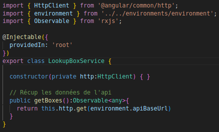
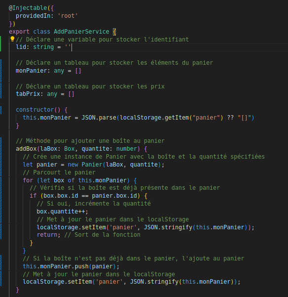

= Compte Rendu E5

Luca KIUSI

Dépôt GitHub : https://github.com/lucalk/SushiApp

Lien de l’application : https://lucalk.github.io/SushiApp/

:toc:
:toc-title: Sommaire

== Maquette
Page d'accueil

Page d'une boxe

Panier

image::site.png//panier.png[]

Historique

image::site.png//historique.png[]

Confirmation de commande

image::site.png//confirmation.png[]

Structure JSON

== Header
Source : header.component.html

=== Résultat final

== Footer
Source : footer.component.html

=== Résultat final

== Configuration du lien d'API
Source : environment.ts

Source : environment.development.ts

== Page d'accueil
=== Service
Source : lookup-box.service.ts

=== Boxes component
Source : boxes-list.component.ts

=== Affichage

Source : boxes-list.html

=== Resultat final

== Détail d'une boxe

=== Models
Source : iBox.ts

Source : Box.ts

=== Details component
Source : detail.component.ts

====
ngOnInit() : Permet de récuperer les données d'une boxe spécifique

localS() : Permet d'ajouter une boxe au panier

localD() : Permet de retirer une boxe du panier
====

=== Résultat final

== Réalisation de la page RGPD
Source : rgpd.component.html

=== Résultat final

== Panier
=== Models
Source : iPanier.ts

Source : Panier.ts

=== Service
Source : add-panier.service.ts

====
addBox() : Permet d'ajouter une box au panier

dBox() : Permet de retirer une box du panier

trash() : Permet de suprimer toute une ligne du panier

getNumCom() : Permet de generer un numéro de commande

getPanier() : Permet de retourner le panier

getResult() : Permet de calculer le prix total d'une commande

resetPanier() : Permet de reset le panier
====

=== Panier component
Source : panier.component.ts

image::

=== Résultat final

== Commande
( concernant l'historique)

=== Models
Source : iCommande.ts

Source : Commande.ts

=== Service

Source : commande.service.ts

== Commander

=== Confirmation de commande
image::site.png//confirmCommande.png[]

== Historique

Source : historique.component.ts

Source : historique.component.html

Rendu final

